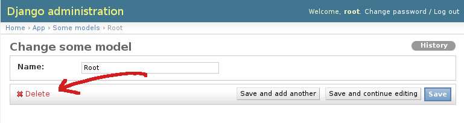

----
layout: post
title: "Django работает не так, как вы думаете"
date: 2013-09-23 13:45 +0300
# categories: CATEGORY-1 CATEGORY-2/
----

# {{ page.title }}


Когда я читаю список плюшек, которые мне предоставляет какой-либо фреймворк, я представляю, что примерно под ними подразумевается. Когда я читаю документацию по плюшкам - я убеждаюсь, что всё в целом действительно так, как я и думал. Когда я пишу код, я постигаю дао. Потому что всё на самом деле совсем не так.

Многие ошибки, которые я допускал, были из-за того, что **я был уверен, что это работает так, как я думаю**. Я верил в это и не допускал возможности, что может быть иначе. Конечно, капитан Очевидность скажет, что не нужно верить - нужно читать документацию. И мы читаем, читаем, запоминаем, запоминаем. Возможно ли удержать все мелочи в памяти? И правильно ли перекладывать их на разработчика, а не на фреймворк?

Ну а чтобы не быть голословным - перейдём к примерам. Нас ждут:

1. Неудаляемые модели, которые мы удалим
2. Валидируемые поля, которые не валидируются
3. Два админа, которые портят данные

## 1. Удаление объектов в админке

Представим, что у вас есть модель, для которой вы хотите переопределить метод удаления. Простейший пример - вы не хотите, чтобы модель с `name == 'Root'` можно было удалить. Первое, что приходит на ум - просто переопределить метод `delete()` для нужной модели:

```python
class SomeModel(models.Model):
    name = models.CharField('name', max_length=100)

    def delete(self, *args, **kwargs):
        if self.name == 'Root':
            print('No, man, i am not deletable! Give up!')  # Для экземпляра "Root" просто выводим сообщение
        else:
            super(SomeModel, self).delete(*args, **kwargs)  # Для всего остального - вызываем стандартный delete()
```

Проверим?



Работает! А теперь проделаем то же, но со страницы списка моделей:


`delete()` не вызывается, модель удаляется.

* **Описывается ли это в документации?** [Да](https://docs.djangoproject.com/en/1.5/ref/contrib/admin/actions/)
* **Зачем это делается?** Для эффективности.
* **Стоит ли эта эффективность полученного неявного поведения?** Вряд ли.
* **Что делать?** Например, вообще отключить массовое удаление (со страницы списка моделей):

```python
class SomeModelAdmin(admin.ModelAdmin):
    model = SomeModel

    def get_actions(self, request):
        actions = super(self.__class__, self).get_actions(request)
        if 'delete_selected' in actions:
            del actions['delete_selected']
        return actions
```

Это были первые django-грабли, на которые я наступил. И в каждом новом проекте я должен держать это поведение в голове и не забывать про него.


## 2. Validators

> Валидатор - функция, которая принимает значение в кидает ValidationError, если значение не подходит по какому-то критерию. Валидаторы могут быть полезны, если нужно многократно использовать какую-то проверку на разных типах полей.

Например, проверку поля на соответствие регулярному выражению: [RegexValidator](https://docs.djangoproject.com/en/1.5/ref/validators/#regexvalidator). Давайте разрешим использовать только буквы в поле `name`:

```python
class SomeModel(models.Model):
    name = models.CharField('name', max_length=100, validators=[RegexValidator(regex=r'^[a-zA-Z]+$')])
```


В админке валидация работает. А если вот так:

```python
# views.py
def main(request):
    new_model = SomeModel.objects.create(name='Whatever you want: 1, 2, 3, etc. Either #&*@^%!)(_')
    return render(
        request,
        'app/main.html',
        {
            'new_model': new_model,
        }
    )
```

Через `create()` можно задать любое имя, и *валидация не вызывается*.

* **Описывается ли это в документации?** [Да](https://docs.djangoproject.com/en/1.5/ref/validators/#how-validators-are-run)

>Обратите внимание, что валидаторы не будут автоматически вызываться при сохранении модели, но если вы используете ModelForm, ваши валидаторы сработают для тех полей, что включены в форму.

* **Очевидно ли это?** Я честно старался представить ситуацию, когда нужно поле валидировать в форме, но не валидировать в остальных случаях. И у меня нет идей. Логичнее сделать валидацию для поля глобальной - то есть если задано, что только буквы, то всё, враг не пройдёт, no pasaran - никоим образом это обойти нельзя. Хочешь снять такое ограничение - переопределяй `model.save()` и отключай валидацию в нужных случаях.

* **Что делать?** Вызывать валидацию явно перед сохранением:

```python
@receiver(pre_save, sender=SomeModel)
def validate_some_model(instance, **kwargs):
    instance.full_clean()
```

## 3. Два админа

Миша и Петя админят сайт. После тысячной записи Миша оставил открытой форму редактирования записи #1001 ("В чём смысл жизни") и ушёл пить чай. В это время Петя открыл ту же запись #1001 и переименовал её ("Смысла нет"). Миша вернулся (открыта ещё "старая" запись "В чём смысл жизни") и нажал "Сохранить". Труды Пети затёрлись.

Это называется отсутствием [Optimistic Locking / Optimistic Concurrency Control](https://en.wikipedia.org/wiki/Optimistic_concurrency_control).

Если вы думаете, что для такой коллизии обязательно нужно два одновременно работающих админа, а вы сайт поддерживаете в одиночку и поэтому в домике, то спешу вас огорчить: это работает, даже если админ один. Например, админ редактирует товар, а пользователь в этот момент товар купил, уменьшив значение в поле `quantity`. У админа поле `quantity` содержит старое значение, так что как только он нажмёт сохранить...

При чём здесь django? А потому что *django предоставляет админку, но не предоставляет optimistic locking*. И поверьте, когда начинаешь работать с админкой, даже и не думаешь об этой проблеме - ровно до тех пор, пока не начнутся странные "затирания" данных и несоответствия в количествах. Ну а дальше - увлекательный дебаг.

* **Описывается ли это в документации?** Нет.
* **Что делать?** [django-optimistic-lock](https://github.com/gavinwahl/django-optimistic-lock), [django-concurrency](https://github.com/saxix/django-concurrency)

Коротко - для каждой модели создаём поле `version`, при сохранении проверяем, что версия не изменилась, и увеличиваем её значение на 1. Если изменилась - бросаем исключение (значит, кто-то другой уже изменил запись).


## Мораль

В заключение повторю то, с чего я начинал:
**Django работает не так, как вы думаете. Django работает ровно так, как написано в его документации. Ни больше, ни меньше.**

Нельзя быть уверенным в имеющемся функционале, пока не прочитаете весь раздел документации про него. Нельзя полагаться на наличие функционала, если о нём не пишется явно в документации. Это очевидные истины... ровно до тех пор, пока вы не попадётесь.